[中文](README.md) | [English](README.en.md)

<div align="center">

<h1>FreightFlow · Road Freight and Settlement</h1>
<p>Consignments → dispatch/load planning → driver execution → delivery review → freight statements</p>
<p>ZhiHua Technology (Shanghai Rujing Zhihua Information Technology Co., Ltd.) · <a href="https://www.zhuatech.cn/">Official website</a></p>
<p><b>1.0.0 · Public source for learning / non-commercial use</b></p>
</div>

A Java 21 / Spring Boot, Vue 3, MySQL and Flyway road-freight system with Chinese/English pages, driver assignments, photo proof of delivery, independent review, receivable/payable statements and manual settlement records. This is **publicly readable non-commercial source**, not an OSI-approved license. Commercial use requires prior written authorization; see [LICENSE](LICENSE).

## One consignment, one trip and two sides of the ledger

For small road-freight teams moving from spreadsheets/paper waybills, consignor coordinators and developers studying transport workflows. Shipments, trips, delivery evidence and receivables/payables share references so unsigned deliveries, unreviewed expenses and unpaid balances can be checked separately.

| Interface/role | Implemented operations |
|---|---|
| Customer portal | Personally linked shipment drafts, quotations, transport states, delivery photos and own receivable statements |
| Dispatch workspace | Quote review; weight/volume/piece load checks; dispatch, issues, independent delivery review and trip closing |
| Driver workspace | Assigned trips/cargo only; accept, depart, upload actual PNG/JPEG evidence, full delivery and expenses; mobile browsers supported |
| Finance workspace | Another account reviews expenses; receivable/payable statements, partial actual payments, linked reversals, profit/cash reports |
| Administration | Customers, carriers, drivers, vehicles, accounts, roles, permissions, menus, departments, dictionaries, settings and audit |

Shipments: draft → ready for loading → loaded → transporting → pending delivery review → delivered. Trips: draft → dispatched → accepted by driver → transporting → closed. Only the actually linked driver may accept, depart and report delivery; administrators cannot substitute. Before departure, cancellation requires a reason and releases shipments/resources. Departed trips cannot be canceled.

Draft trips already reserve drivers/vehicles. Planned intervals use half-open overlap checks. Resources remain occupied throughout actual transport until closing, regardless of an expired planned end. Exceeding weight, volume or piece capacity is rejected. Closing requires every shipment delivered, all issues resolved and expenses reviewed.

Receivable statements select reviewed deliveries; payable statements select closed trips and contain agreed carrier fees plus approved reimbursable expenses. Lines freeze. Payments and reversals retain original entries and cannot be overwritten/deleted. Zero-value statements settle without fabricated payments.

**Scope:** one enterprise, multiple departments, direct single-trip transport, full delivery and manually recorded payment facts. No GPS/live tracking, route optimization, e-invoicing, payment gateway, electronic signatures, insurance claims, customs, partial delivery, vehicle changes in transit, multi-leg transfers or inventory. Photo evidence is not an electronic signature with an asserted legal status. The application does not collect payments or invoke paid services. External integration requires development/configuration. No verified customer/revenue claims are made.

## Actual running pages

Screenshots are from an isolated test database; every business example is marked TEST, not actual customer/commercial data.

| Login | Customer home |
|---|---|
| 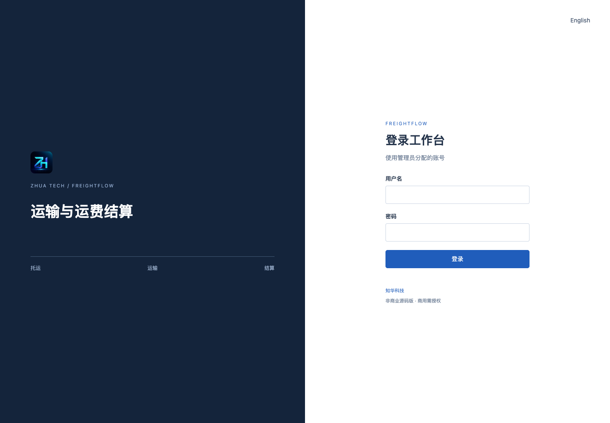 | 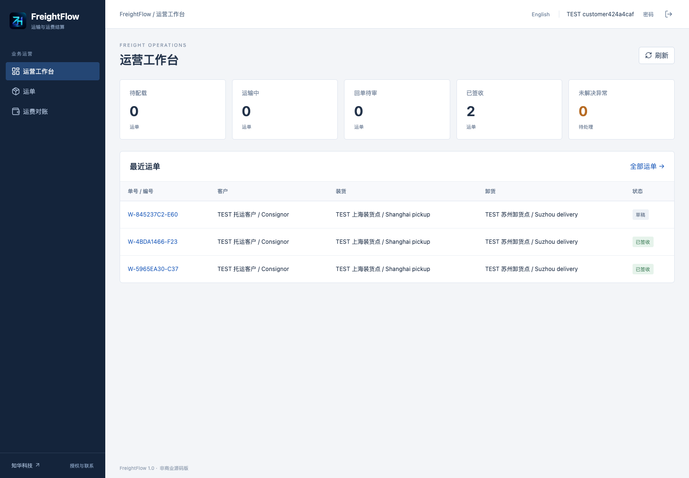 |

Login: real account authentication into an authorized workspace. Customer home: own consignments, delivery and receivables.

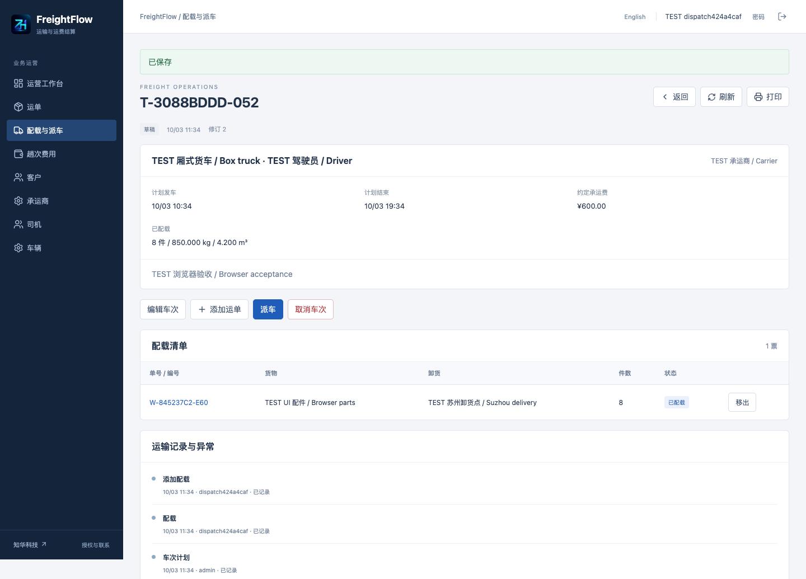

Dispatch: quotations, trip planning and weight/volume/piece capacity checks.

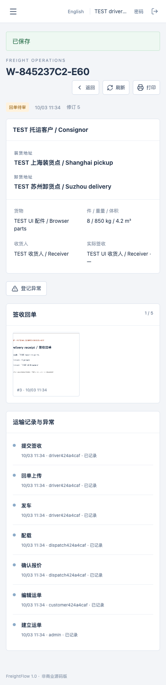

Mobile driver: assigned trip acceptance/departure and actual delivery photo uploads.

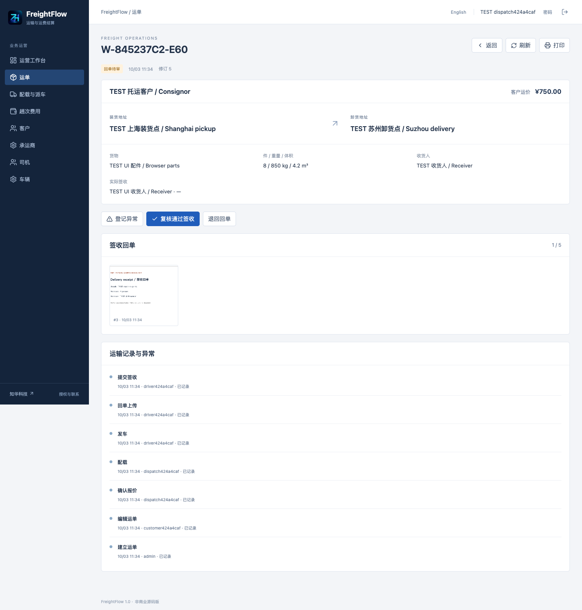

Shipment details: actual photos, delivery facts and issue evidence.

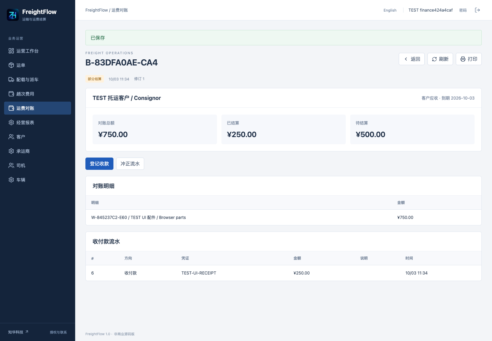

Finance: frozen statements, actual receipts/payments and linked reversals.

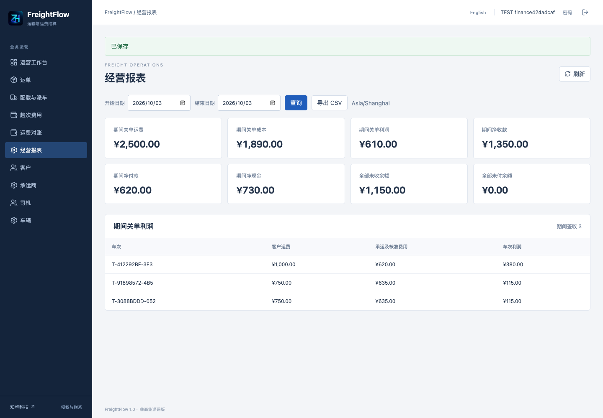

Reports: authorized period revenue/cost/profit, net cash and outstanding balances.

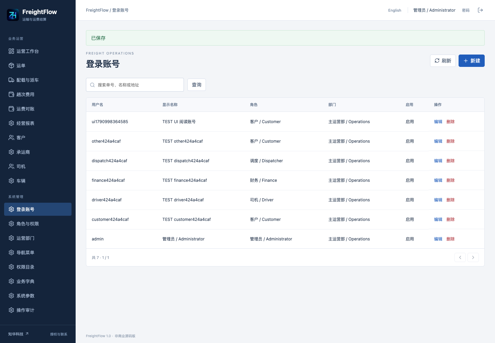

Accounts: customer, driver and internal accounts with enabled status.

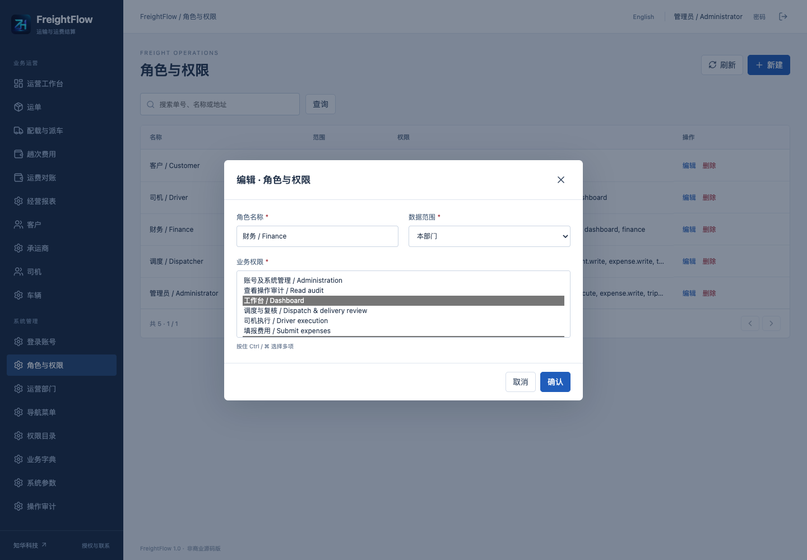

Roles: functional permissions and actually linked data scopes.

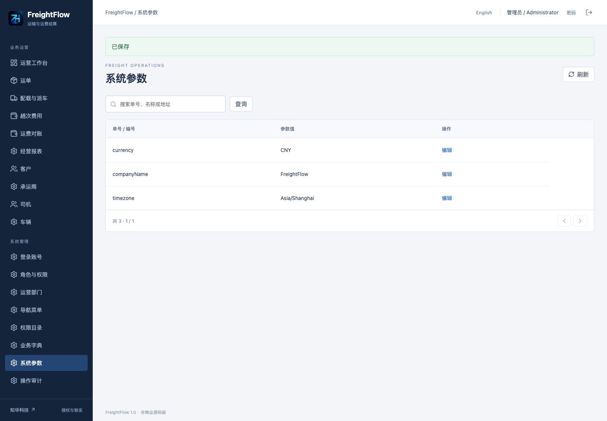

Settings: supported name, currency and timezone; currency/timezone lock after business data exists.

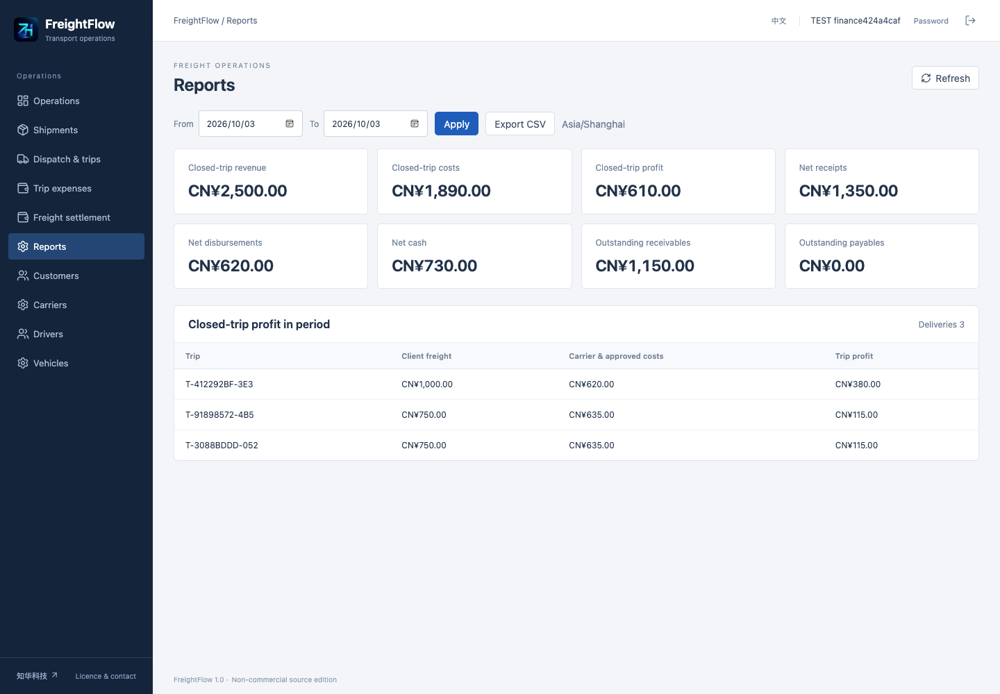

English interface: English transport and administration pages.

Business/admin roles share a login; database roles govern menus/object scopes. There is no anonymous self-registration or shared demo password. See [User manual](docs/manual.md). Detailed linked manuals are currently in Chinese.

## Requirements and first startup

Python 3, Docker Engine and Docker Compose v2; source development additionally needs Java 21, Maven 3.9, Node.js 24.19.0+, npm and MySQL 8.4. Reserve about 4 GB for a full local build. Initial images/dependencies need registry access.

```sh
python3 scripts/init-env.py
docker compose config --quiet
docker compose up --build -d --wait --wait-timeout 240
```

Interface: [http://127.0.0.1:8101/](http://127.0.0.1:8101/). Health: [http://127.0.0.1:8101/actuator/health](http://127.0.0.1:8101/actuator/health). Default administrator username is `admin`; the initialization script creates independent random passwords in ignored `.env`, with mode 0600, refusing to overwrite existing files. If configuration exists, start directly. No fixed weak password is provided. An empty database creates the administrator, five roles, 14 permissions, menus, a department, payment-method dictionaries and company/currency/timezone settings. Restarts do not reset existing passwords.

`SEED_DEMO=true` optionally creates clearly labeled DEMO customer/carrier master records in a new database. It creates no drivers, business accounts, shipments, trips or income. Before actual transport, create customer/driver/dispatch/finance accounts, bind master records and add vehicles; see the manual.

### Configuration

| Name | Meaning |
|---|---|
| `MYSQL_ROOT_PASSWORD`, `DATABASE_PASSWORD` | Independent strong database passwords; no defaults |
| `ADMIN_USERNAME`, `ADMIN_PASSWORD` | First initialization; password 12–72 characters including upper/lowercase letters and digits |
| `WEB_PORT`, `BIND_ADDRESS` | Defaults 8101 / 127.0.0.1; override occupied ports, e.g. `WEB_PORT=18103 docker compose up -d` |
| `COOKIE_SECURE` | false for local HTTP; true behind HTTPS |
| `SEED_DEMO` | false by default; optional new-database basic demonstration directories only |
| `DATABASE_URL`, `DATABASE_USER` | Optional external MySQL; `jdbc:mariadb://...`; verify server certificates over external networks |

See [.env.example](.env.example) for names. Default Compose exposes only loopback Nginx, not MySQL/backend ports. HTTPS, domains, certificates, backup storage and external MySQL are deployment responsibilities. Commercial deployment requires authorization. See [Deployment, upgrades and recovery](docs/deployment.md).

### Source development

Prepare a dedicated fresh MySQL database and least-privilege account. Inject `DATABASE_URL`, `DATABASE_USER`, `DATABASE_PASSWORD` and `ADMIN_PASSWORD` through controlled configuration, then at the repository root:

```sh
mvn -f backend/pom.xml spring-boot:run
```

In another terminal:

```sh
cd frontend
npm ci
npm run dev
```

Vite proxies local backend port 8080 only in development. Production uses same-origin `/api`, without a hardcoded host backend. Do not type real passwords into history or put them in source.

## Architecture, structure and database initialization

```text
backend/        Java 21 / Spring Boot 4.0.7; identity, transport, photos, finance and reports
frontend/       Vue 3.5 / Vite 8; bilingual responsive business/administration interfaces
scripts/        Private configuration, actual HTTP acceptance and release checks
compose.yaml    MySQL → backend → Nginx health dependencies and dedicated persistent volume
docs/           Operations, API, architecture, database, security, deployment and tests
```

Spring Security/JPA, BCrypt cost 12, sessions/CSRF and Flyway form the backend. MariaDB JDBC accesses MySQL. Vue uses Lucide, ESLint and Prettier; Nginx provides same-origin proxy/SPA fallback. MySQL 8.4, versioned SQL, foreign keys, checks and indexes persist real facts. Amounts use cents without automatic rounding. Database timestamps use UTC; planned input uses the enterprise timezone and rejects missing/ambiguous daylight-saving minutes.

[V1__freight_schema.sql](backend/src/main/resources/db/migration/V1__freight_schema.sql) creates 22 application tables plus Flyway history. Original delivery binaries/checksums live in the database and are restored together, without temporary-file dependencies. Currency/timezone lock once business records exist. See [Database](docs/database.md), [API/state conventions](docs/api.md) and [Architecture](docs/architecture.md).

Business writes lock the base department before checking current state at READ COMMITTED. Versions reject stale updates; account/action/content request fingerprints protect exact retries. This serializes enterprise writes and is not a high-throughput distributed dispatch claim. Pages have at most 100 entries; each loaded type is bounded at 10,000 and reports an explicit limit error. Large data volumes require further database pagination, lock design and capacity validation.

## Validation

```sh
mvn -B -f backend/pom.xml spotless:check test package
cd frontend
npm ci --no-audit --no-fund
npm run format:check
npm run lint
npm test
npm run build
cd ..
python3 scripts/release-check.py
git diff --check
docker compose config --quiet
docker compose build
```

Backend tests cover states, amounts, scopes, capacities, retries, reversals and concurrent writes. Integration tests use isolated H2 MySQL mode with dynamically generated credentials. Docker backend builds execute tests. H2 does not replace actual deployment acceptance.

After starting a **fresh isolated disposable test database**:

```sh
python3 scripts/smoke.py --base http://127.0.0.1:8101 --env .env --allow-test-writes
```

This writes TEST accounts/master/business records; never target an existing business database. Actual MySQL and browser validation is documented in [Testing](docs/testing.md). The existing script validates the workflow; separate backup restoration must also check logins, original photos/checksums, shipments, invoices and settlement entries.

## Deployment, upgrades and recovery

See [Deployment](docs/deployment.md). Default loopback deployment is not external production acceptance. External hosting requires authorization, controlled HTTPS, secure cookies, trusted proxies, network isolation, least privilege, appropriate monitoring and backups. External database connections should verify certificates with trusted CAs.

Pause writes, retain application/configuration versions and create restricted complete database backups outside public source. Use consistent logical backup with `--hex-blob` to retain original photo binaries; backups contain credentials' hashes and business records. Keep them mode 0600 and protected, never publish backup contents or secrets. Restore into a new isolated database, import the complete backup before starting the matching backend, then check migrations, health, login, original image SHA-256, shipments, statements and entries. Do not merge a backup into an active business database.

Upgrade using new versioned migrations. Never modify executed V1, delete Flyway history or use repair to conceal differences. JPA validates rather than creates schemas. Validate upgrade on a restored copy; revert using matching older images and a verified preupgrade backup during the deployment's maintenance procedure. `docker compose down` retains volumes. **Volume removal deletes data and is only for explicitly disposable test resources.**

## Troubleshooting

| Symptom | Check |
|---|---|
| Missing Compose variables | Initialize private configuration and confirm three required passwords |
| Login fails | Original initialization password; existing accounts are not reset by env changes; repeated failures are rate-limited |
| Cannot act as driver | Bound driver account, ASSIGNED scope and actual trip driver; admins cannot substitute |
| Driver/vehicle busy | Unfinished trips; cancel predeparture reservations or close actual transport |
| Cannot submit delivery/close | Valid PNG/JPEG, full piece count, resolved issues, independent delivery and expense reviews |
| Database unhealthy | This isolated project's logs/account rights; preserve the database volume |
| Flyway validation fails | Restore trusted migration files or follow upgrade procedures; never rewrite checksums |
| Session cookie unavailable | `COOKIE_SECURE=false` for local HTTP, true for HTTPS |

## Security, contributions and license

Never commit `.env`, backups, cookies, customer records or unredacted logs. Passwords are hashed; sessions use HttpOnly/SameSite Strict cookies and CSRF. Backend interface/object authorization is enforced; role changes/disablement take effect immediately. Customers read only own consignments/photos/receivables. Drivers read assigned trips/cargo with financial fields removed. Menu visibility is not the authorization boundary.

Photos are valid PNG/JPEG only, at most 2 MiB each, five per shipment and bounded pixels, with decoding validation. Downloads check object scope with no arbitrary file access. See [Security](docs/security.md) and [Third-party notices](docs/third-party.md).

Share redacted reproducible issues and tested contributions preserving copyrights. Report security concerns privately. This learning version is provided as is: assess business suitability, capacity, authorization, deployment, backups and local requirements. Reports are business summaries, not statutory accounting/tax or payment reconciliation.

Own code uses [ZhuaTech Non-Commercial Source License 1.0](LICENSE), permitting personal learning, technical research and non-commercial exchange only. **Commercial use requires prior written authorization from Shanghai Rujing Zhihua Information Technology Co., Ltd.** Enterprise private deployment, paid delivery/services, SaaS, resale and in-depth customization require separate authorization. Preserve attribution, website, copyright, license and licensing contacts. Third-party licenses remain separate. No unverified production-readiness claim is made; commercial scope is defined by written agreement.

## Contact ZhiHua Technology

For commercial licensing, in-depth custom development, private deployment or system integration, contact **ZhiHua Technology (Shanghai Rujing Zhihua Information Technology Co., Ltd.)**:

- Website: [https://www.zhuatech.cn/](https://www.zhuatech.cn/)
- Email: [han@zhuatech.cn](mailto:han@zhuatech.cn)
- Email: [jack@zhuatech.cn](mailto:jack@zhuatech.cn)
- WhatsApp: [+86 17521234993](https://wa.me/8617521234993)
